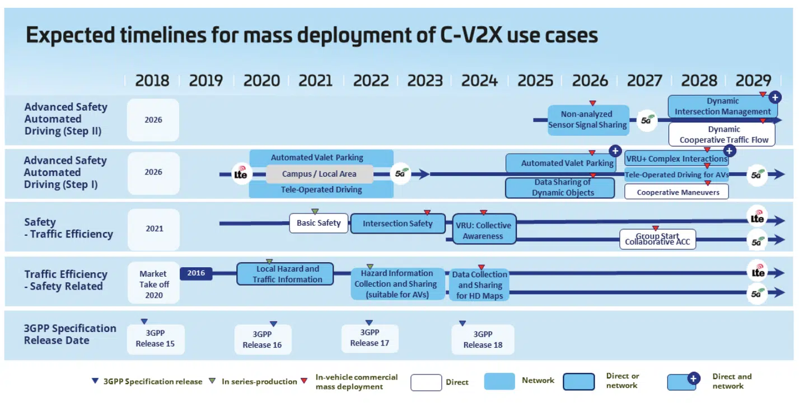

Standards & Industry Organizations
======

* [3GPP](https://www.3gpp.org/) &#124; [ftp](https://www.3gpp.org/ftp/)
* [5GAA](https://5gaa.org/)
* [IMT-2020](https://www.imt2020.org.cn/) &#124; [C-V2X](http://v2x.caict.ac.cn/index.html)
* [IMT-2030(6G)](https://www.imt2030.org.cn/)
* [CAICV](http://www.caicv.org.cn/index.php/index)
* [CAICT](http://www.caict.ac.cn/)
* [CSAE](https://zhishi.sae-china.org/)

Academic Group
======

| Leader | Group Web | Affiliation | Google scholar | IEEE | Github | Member |
| :---: | :---: | :---: | :---: | :---: | :---: | :---: |
| Keqiang Li | [THICV](https://www.labxing.com/thicv) | Tsinghua University | [Link](https://scholar.google.com/citations?hl=en&user=x58fnLQAAAAJ&view_op=list_works&sortby=pubdate) | [Link](https://ieeexplore.ieee.org/author/37277621900) | - | -
| Bo Cheng | [iDLAB](http://www.idlab-tsinghua.com/thulab/labweb/index.html) | Tsinghua University | - | [Link](https://ieeexplore.ieee.org/author/37577309100) | - | -
| Zhisheng Niu | [NiuLab](http://network.ee.tsinghua.edu.cn/niulab/) | Tsinghua University | [Link](https://scholar.google.com/citations?hl=en&user=gnxgnwQAAAAJ&view_op=list_works&sortby=pubdate) | [Link](https://ieeexplore.ieee.org/author/37269009300) | - | [Sheng Zhou](http://network.ee.tsinghua.edu.cn/shengzhou/index.html)
| Hang Zhao | [MARS Lab](http://group.iiis.tsinghua.edu.cn/~marslab/#/) | Tsinghua University | [Link](https://scholar.google.com/citations?hl=zh-CN&user=DmahiOYAAAAJ&view_op=list_works&sortby=pubdate) | [Link](https://ieeexplore.ieee.org/author/37086256017) | [Link](https://github.com/Tsinghua-MARS-Lab) | -
| Yaqin Zhang | [AIR](https://air.tsinghua.edu.cn/) | Tsinghua University | [Link](https://scholar.google.com/citations?user=mDOMfxIAAAAJ&hl=en&oi=ao) | [Link]() | [Link](https://github.com/AIR-THU) | - |
| [Xuemin Shen](https://uwaterloo.ca/scholar/sshen) | [BBCR Group](https://uwaterloo.ca/broadband-communications-research-lab/) | University of Waterloo | [Link](https://scholar.google.com.hk/citations?hl=en&user=Bjl3GwoAAAAJ&view_op=list_works&sortby=pubdate) | [Link](https://ieeexplore.ieee.org/author/37278603300) | - | -
| Xiang Cheng | [PCNI](http://pcni.pku.edu.cn/cn/homepage.html) | Peking University | [Link](https://scholar.google.com.hk/citations?hl=en&user=RSLHBzgAAAAJ&view_op=list_works&sortby=pubdate) | [Link](https://ieeexplore.ieee.org/author/37399092900) | - | -
| Huijing Zhao | [POSS](http://www.poss.pku.edu.cn/index.html) | Peking University | [Link](https://scholar.google.com/citations?user=q-aZF-kAAAAJ&hl=en&oi=sra) | [Link](https://ieeexplore.ieee.org/author/37290336200) | - | -
| Shanzhi Chen | - | CICT | [Link](https://scholar.google.com.hk/citations?hl=en&user=6j02EGoAAAAJ&view_op=list_works&sortby=pubdate) | [Link](https://ieeexplore.ieee.org/author/37290960300) | - | -
| [Zhu Han](http://www2.egr.uh.edu/~zhan2/) | [Wireless Networking, Signal Processing and Security Lab](https://wireless.egr.uh.edu/) | University of Houston | [Link](https://scholar.google.com.hk/citations?hl=en&user=ty7wIXoAAAAJ&view_op=list_works&sortby=pubdate) | [Link](https://ieeexplore.ieee.org/author/37278605300) | - | -
| Si Liu | [CoLab](http://colalab.net/) | Beihang University | [Link](https://scholar.google.com/citations?user=-QtVtNEAAAAJ&hl=en&oi=sra) | [Link](https://ieeexplore.ieee.org/author/37406043500) | - | - | 
| Ming Yang | [CyberC3 IV Lab](https://cyberc3.sjtu.edu.cn/index.htm) | Shanghai Jiaotong University | [Link](https://scholar.google.com/citations?hl=en&user=0TCYA3YAAAAJ&view_op=list_works&sortby=pubdate) | [Link](https://ieeexplore.ieee.org/author/37576820400) | - | -
| [Guoqiang Mao](http://www.guoqiangmao.com/index.html) | [ISN](https://isn.xidian.edu.cn/index.htm) | XIDIAN University | [Link](https://scholar.google.com/citations?hl=en&user=v98il94AAAAJ&view_op=list_works&sortby=pubdate) | [Link](https://ieeexplore.ieee.org/author/37298234600) | - | [Changle Li](https://scholar.google.com/citations?user=rTlcIV8AAAAJ&hl=en&oi=ao) &#124; [Yilong Hui](https://scholar.google.com/citations?hl=en&user=q0U7esoAAAAJ&view_op=list_works&sortby=pubdate)
| Nan Cheng | [UNIC Lab](https://www.unicxidian.org/tour/) | XIDIAN University | [Link](https://scholar.google.com/citations?hl=en&user=Cxm51twAAAAJ&view_op=list_works&sortby=pubdate) | [Link](https://ieeexplore.ieee.org/author/37070953100) | - | [Ruijing Sun](https://scholar.google.com/citations?hl=en&user=R43nWm4AAAAJ&view_op=list_works&sortby=pubdate)
| [Kai Liu](https://sites.google.com/site/liukai0807/home) | [BDSC](http://www.bdsc.site/) | Chongqing University | [Link](https://scholar.google.com/citations?hl=en&user=6YkCbT8AAAAJ&view_op=list_works&sortby=pubdate) | [Link](https://ieeexplore.ieee.org/author/38269608600) | - | [Xincao Xu](https://www.neardws.com/)
| Nanning Zhen | [IAIR](http://iair.xjtu.edu.cn/index.htm) | XIAN JIAOTONG University | - | - | - | -
| Rongjun Ding | [HIVE Lab](http://hive-lab.hnu.edu.cn/index.htm) | HUNAN University | - | [Link](https://ieeexplore.ieee.org/author/37089706133) | - | -
| Daxin Tian | / | Beihang University | [Link](https://scholar.google.com/citations?hl=en&user=Dz3E33gAAAAJ&view_op=list_works&sortby=pubdate) | [Link](https://ieeexplore.ieee.org/authsor/37406931400) | - | - |
| [Weisong Shi](https://weisongshi.org/) | [Connected and Autonomous Research Laboratory (CAR)](https://www.thecarlab.org/home) | University of Delaware | [Link](https://scholar.google.com/citations?user=4rPcoCEAAAAJ&hl=en&oi=ao) | [Link](https://ieeexplore.ieee.org/author/37278937600) | - | [Zheng Dong](https://zheng.eng.wayne.edu/) |
| Jiaqi Ma | [UCLA Mobility Lab](https://mobility-lab.seas.ucla.edu/about/) | University of California | [Link](https://scholar.google.com/citations?hl=en&user=S3cQz1AAAAAJ&view_op=list_works&sortby=pubdate) | [Link](https://ieeexplore.ieee.org/author/37085693088) | [Link](https://github.com/ucla-mobility) | [Runsheng Xu](https://github.com/DerrickXuNu)
| [Hang Qiu](https://hangqiu.github.io/) | [CISL](https://cisl.ucr.edu/) | University of California | - | [Link](https://scholar.google.com/citations?user=9i_MgykAAAAJ&hl=en&oi=sra) | - | - |
| [Siheng Chen](https://siheng-chen.github.io/) | [Shanghai AI Lab](https://www.shlab.org.cn/aboutus) | Shanghai Jiaotong University | [Link](https://scholar.google.com/citations?user=W_Q33RMAAAAJ&hl=en&oi=ao) | [Link](https://ieeexplore.ieee.org/author/37085436580) | - | -
| Hongyang Li | [OpenDriveLab](https://opendrivelab.com/) | Shanghai Jiaotong University | [Link](https://scholar.google.com/citations?hl=en&user=Hfrih1EAAAAJ&view_op=list_works&sortby=pubdate) | [Link](https://ieeexplore.ieee.org/author/37089612139) | [Link](https://github.com/OpenDriveLab) | -
| [Yikang Li](https://liyikang.top/) | [ADG@PJLab](https://pjlab-adg.github.io/) | Shanghai Jiaotong University | [Link](https://scholar.google.com/citations?user=G9b6hpYAAAAJ&hl=en&oi=sra) | [Link](https://ieeexplore.ieee.org/author/37089161200) | [Link](https://github.com/PJLab-ADG) | [github](https://github.com/yikang-li) |
| Junchi Yan | [Thinklab](https://thinklab.sjtu.edu.cn/index.html) | Shanghai Jiaotong University | [Link](https://scholar.google.com/citations?user=ga230VoAAAAJ&hl=en&oi=ao) | [Link](https://ieeexplore.ieee.org/author/37407421600) | [Link](https://github.com/Thinklab-SJTU) | - |
| Chen Feng | [AI4CE Lab](https://ai4ce.github.io/) | New York University | [Link](https://scholar.google.com/citations?user=YeG8ZM0AAAAJ&hl=en&oi=ao) | [Link](https://ieeexplore.ieee.org/author/37086391326) | - | [Yiming Li](https://roboticsyimingli.github.io/)
| Haixia Zhang | [ICON Lab](http://www.icon.sdu.edu.cn/index.htm) | Shandong University | [Link](http://control.sdu.edu.cn/info/1083/2286.htm) | [Link](https://ieeexplore.ieee.org/author/37280795800) | - | -
| [Falko Dressler](https://www.tkn.tu-berlin.de/team/dressler/) | [TKN](https://www.tkn.tu-berlin.de/) | TU Berlin | [Link](https://scholar.google.com/citations?user=sK8213AAAAAJ&hl=en&oi=ao) | [Link](https://ieeexplore.ieee.org/author/37088730245) | [Link](https://github.com/tkn-tub) | - |
| [Jian Sun](https://tops.tongji.edu.cn/index.htm)| [TOPS](https://tops.tongji.edu.cn/index.htm) | Tongji University | [Link](https://scholar.google.com/citations?user=ALVSZAYAAAAJ&hl=en&oi=sra) | [Link](https://ieeexplore.ieee.org/author/37407524800) | - | - | 
| [Jie Wang](https://miralab.ai/people/jie-wang/) | [MIRA Lab](https://miralab.ai/) | USTC | [Link](https://scholar.google.com/citations?user=OugG4dUAAAAJ&hl=en&oi=sra) | [Link](https://ieeexplore.ieee.org/author/37088893312) | [Link](https://github.com/MIRALab-USTC) | - |
| [Shuai Wang](https://bearswang.github.io/index.html) | [SIAT-INVS LAB](https://bearswang.github.io/siat-invs.html) | Shenzhen Institute of Advanced Technology | [Link](https://scholar.google.com.hk/citations?hl=zh-CN&user=W7WcEW0AAAAJ&view_op=list_works) | [Link](https://ieeexplore.ieee.org/author/37090019250) | [Link](https://github.com/bearswang) | - |
| Wei Zhan | [MSC Lab](https://msc.berkeley.edu/) | UC Berkeley | [Link](https://scholar.google.com/citations?hl=en&user=xVN3UxYAAAAJ&view_op=list_works&sortby=pubdate) | [Link](https://ieeexplore.ieee.org/author/37088772102) | - | - |
| Masayoshi Tomizuka | [Mechanical Systems Control Lab](https://msc.berkeley.edu/) | University of California Berkeley | [Link](https://scholar.google.com/citations?user=8m8taGEAAAAJ&hl=en&oi=ao) | [Link](https://ieeexplore.ieee.org/author/37281933000) |
| Tong Lu | [IMAGINE Lab](https://cs.nju.edu.cn/lutong/index.htm) | Nanjing University | - | [Link](https://ieeexplore.ieee.org/author/37403551600) | - |
| Yuxiang Sun | [The Autonomous Systems Lab (ASL)](https://labsun.org/) | City University of Hong Kong | [Link](https://scholar.google.com/citations?user=CuCSzQQAAAAJ&hl=en&oi=ao) | [Link](https://ieeexplore.ieee.org/author/37085435479) | [Link](https://labsun.org/) |
| [Xiang Bai](https://xbai.vlrlab.net/) | [VLR group](https://vlrlab.net/) | Huazhong University of Science and Technology | [Link](https://scholar.google.com/citations?user=UeltiQ4AAAAJ&hl=en&oi=sra) | [Link](https://ieeexplore.ieee.org/author/37307015500) | - |
| Yuexin Ma | [4DV Lab](https://yuexinma.me/index.html) | ShanghaiTech University | [Link](https://scholar.google.com/citations?user=DIsP7rUAAAAJ&hl=zh-CN) | [Link](https://ieeexplore.ieee.org/author/37089018085) | [Link](https://github.com/4DVLab) |
| Moshe Ben-Akiva | [ITS Lab](https://www.its.mit.edu/) | MIT | [Link](https://scholar.google.com/citations?user=HubmsyoAAAAJ&hl=en&oi=ao) | [Link](https://ieeexplore.ieee.org/author/38277775200) | - | - |
| [Song Han](https://songhan.mit.edu/) | [HAN Lab](https://songhan.mit.edu/) | MIT | [Link](https://scholar.google.com/citations?user=E0iCaa4AAAAJ&hl=en&oi=sra) | [Link](https://ieeexplore.ieee.org/author/37086460117) | [Link](https://github.com/mit-han-lab) | - |
| Chen Lv | [AutoMan Research Lab](https://lvchen.wixsite.com/automan) | Nanyang Technological University | [Link](https://scholar.google.com/citations?user=UKVs2CEAAAAJ&hl=en) | [Link](https://ieeexplore.ieee.org/author/37086095836) |
| [Ding Zhao](https://safeai-lab.github.io/people.html) | [CMU Safe AI Lab](https://safeai-lab.github.io/index.html) | CMU | [Link](https://scholar.google.com/citations?user=z7tPc9IAAAAJ&hl=en&oi=sra) | [Link](https://ieeexplore.ieee.org/author/37085680141) | [Link](https://github.com/safeai-lab) | - |
| Sebastian Steinhorst | [TUM ESI](https://www.ce.cit.tum.de/en/esi/home/) |  Technical University of Munich | [Link](https://scholar.google.com/citations?user=nUd33p4AAAAJ&hl=en&oi=ao) | [Link](https://ieeexplore.ieee.org/author/37543141800) | [Link](https://github.com/tum-esi) | - |
| Kazuya Takeda | [BSPL](https://takedalab.g.sp.m.is.nagoya-u.ac.jp/groups/autonomous-driving-group) | Nagoya University | [Link](https://scholar.google.com/citations?hl=en&user=O4epWMcAAAAJ&pagesize=100&view_op=list_works&sortby=pubdate) | [Link](https://ieeexplore.ieee.org/author/37269965700) | - | - |
| [Deva Kannan Ramanan](https://www.ri.cmu.edu/ri-faculty/deva-kannan-ramanan/) | [CMU AV Center](https://labs.ri.cmu.edu/av-center/) | Carnegie Mellon University | [Link](https://scholar.google.com/citations?user=9B8PoXUAAAAJ&hl=en&oi=ao) | [Link](https://ieeexplore.ieee.org/author/37393712400) | - | - |
| [Mohan Trivedi](https://jacobsschool.ucsd.edu/faculty/profile?id=68) | [LISA](https://cvrr.ucsd.edu/) | UC SAN DIEGO | [Link](https://scholar.google.com/citations?user=LkONrRAAAAAJ&hl=en&oi=ao) | [Link](https://ieeexplore.ieee.org/author/37271845000) | - | - |
| Ian Manchester | [ACFR](https://robotics.sydney.edu.au/) | University of Sydney | [Link](https://scholar.google.com/citations?user=VEPTSCUAAAAJ&hl=en&oi=ao) | [Link](https://ieeexplore.ieee.org/author/37403574900) | - | - |
| Manabu Tsukada | [Tsukada Laboratory](https://tlab.hongo.wide.ad.jp/) | University of Tokyo | [Link](https://scholar.google.com/citations?user=GSfYxPIAAAAJ&hl=en&oi=ao) | [Link](https://ieeexplore.ieee.org/author/37287307400) | [Link](https://github.com/tlab-wide) | | 
| Dariu M. Gavrila | [IV](https://intelligent-vehicles.org/) | Delft University of Technology | [Link](https://scholar.google.com/citations?hl=en&user=wQU1dJAAAAAJ&pagesize=100&view_op=list_works) | [Link](https://ieeexplore.ieee.org/author/37284630500) | [Link](https://github.com/tudelft-iv) | - |
| [Ming C. Lin](http://www.cs.umd.edu/~lin/) | [GAMMA Research Group](https://gamma.umd.edu/) | University of Maryland | [Link](https://scholar.google.com/citations?user=ugFNit4AAAAJ&hl=en&oi=sra) | [Link](https://ieeexplore.ieee.org/author/37278387400) | - | - |
| Seung-Hyun Kong | [AVE Lab](https://ave.kaist.ac.kr:59676/?ckattempt=1) | Korea Advanced Institute of Science and Technology | - | [Link](https://ieeexplore.ieee.org/author/38065262900) | [Link](https://github.com/kaist-avelab) | - |
| [Marco Pavone](https://web.stanford.edu/~pavone/index.html) | [NVIDIA Research (AV)](https://nvr-avg.github.io/) | NVIDIA | [Link](https://scholar.google.com/citations?user=RhOpyXcAAAAJ&hl=en&oi=ao) | [Link](https://ieeexplore.ieee.org/author/37307912900) | [Link](https://github.com/NVlabs) | - |
| - | [Google-Research](https://research.google/) | Google | - | - | [Link](https://github.com/google-research/google-research) | - |
| - | [NOAH'S ARK Lab](https://noahlab.com.hk/#/home) | HUAWEI | - | - | [Link](https://github.com/huawei-noah) | - |
| - | [OpenAI](https://openai.com/) | OpenAI | - | - | [Link](https://github.com/openai) | - |
| - | [Apollo](https://www.apollo.auto/) | Baidu | - | - | [Link](https://github.com/ApolloAuto) | - |
| - | Microsoft | Microsoft | - | - | [Link](https://github.com/microsoft) | - |
| - | [Meta Research](https://research.facebook.com/) | Meta | - | - | [Link](https://github.com/facebookresearch) | - |
| Mikio Takenaka | [R&D Center](https://www.sony.com/en/SonyInfo/research/about/china-laboratory/) | SONY | - | - | - | - |
| - | [DAMO Academy, ADLab-AutoDrive](https://damo.alibaba.com/) | Alibaba Group | - | - | [Link](https://github.com/ADLab-AutoDrive) | - |
| - | [Intel Labs](https://www.intel.com/content/www/us/en/research/overview.html) | Intel | - | - | [Link](https://github.com/IntelLabs) | - |
| [Naiyan Wang](https://winsty.net/) | [TuSimple](https://cn.tusimple.com/) | TuSimple | [Link](https://ieeexplore.ieee.org/author/37085671305) | [Link](https://ieeexplore.ieee.org/author/37085671305) | [Link](https://github.com/TuSimple) | - |

## CV-Team
- [Awesome-CV-Team](https://github.com/extreme-assistant/Awesome-CV-Team)

Simulator
======

| Name | Homepage | github | Contributor |
| :---: | :---: |  :---: |  :---: | 
| Veins | [Link](http://veins.car2x.org/) | [Link](https://github.com/veins) | [Christoph Sommer](https://www.cms-labs.org/people/sommer/) |
| OMNeT++ | [Link](https://omnetpp.org/) | [Link](https://github.com/omnetpp) | TÖRÖK Attila |
| SUMO | [Link](https://sumo.dlr.de/docs/index.html) | [Link](https://github.com/eclipse/sumo) | Jakob Erdmann |
| CARLA | [Link](http://carla.org/) | [Link](https://github.com/carla-simulator) | [Felipe Codevilla](https://www.codevilla.info/) ; [Alexey Dosovitskiy](https://scholar.google.com/citations?user=FXNJRDoAAAAJ&hl=en&oi=sra) |
| ns-3 | [Link](https://www.nsnam.org/) | [Link](https://github.com/nsnam) | [Alex Afanasyev](https://users.cs.fiu.edu/~afanasyev/) |
| CVX | [Link](http://cvxr.com/) | [Link](https://github.com/cvxr) | [Michael C. Grant](http://cvxr.com/bio/) |
| Tensorflow | [Link](https://www.tensorflow.org/?hl=zh-cn) | [Link](https://github.com/tensorflow/tensorflow) | [Mihai Maruseac](https://mihai.page/) |
| PyTorch | [Link](https://pytorch.org/) | [Link](https://github.com/pytorch) | [Soumith Chintala](https://soumith.ch/) |

Autonomous Driving Dataset
======

### Single vehicle 
- [KITTI](https://www.cvlibs.net/datasets/kitti/eval_object.php?obj_benchmark=3d)
- [nuScenes](https://www.nuscenes.org/)
- [OpenDataLab](https://opendatalab.org.cn/home)

### Cooperative
- [Collaborative_Perception](https://github.com/Little-Podi/Collaborative_Perception) |  |  |
